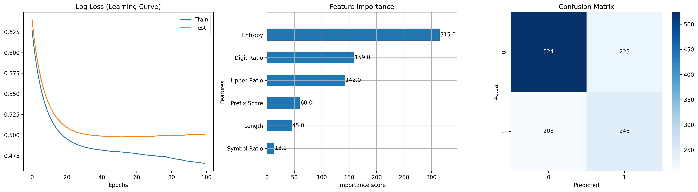

# CodeSentry


**CodeSentry** is a machine learning–based desktop application built with **CustomTkinter** and **XGBoost** for detecting potential leaks of API keys, tokens, and other sensitive credentials in source code.

Unlike traditional tools that rely solely on regular expressions, CodeSentry combines **statistical feature analysis** (e.g., Shannon entropy) with **ML-based classification** to identify high-risk random-looking secrets (such as AWS or OpenAI-style keys), while significantly reducing false positives caused by ordinary variables or noise.

---

## Features

* **ML-driven detection**  
  Uses an XGBoost model to analyze string entropy, character ratios, and structural patterns to determine whether a string is likely to be sensitive.

* **Modern GUI**  
  Dark-mode desktop interface built with CustomTkinter, featuring real-time progress updates.

* **Risk-based classification**  
  * **CRITICAL**: Very high confidence; matches common credential patterns (e.g., AWS, OpenAI keys).  
  * **HIGH**: Highly suspicious random-looking strings.  
  * **MEDIUM**: Possibly a credential or a high-entropy variable.  
  * **LOW**: Low-confidence or partial matches; usually filtered as noise or placeholders requiring manual review.

* **Recursive directory scanning**  
  Supports deep scanning of project folders while automatically ignoring directories such as .git, venv, and __pycache__.

* **Multithreaded execution**  
  Scanning runs in background threads to ensure a smooth and responsive UI.

---

## Technical Overview

* **Frontend**: Python (CustomTkinter, Tkinter)
* **Core Model**: XGBoost (Gradient Boosting Decision Trees)

### Feature Engineering

The detection engine utilizes the following features to evaluate strings:

1. **Shannon Entropy**: Measures the randomness of strings.
2. **Regex Pre-filter**: Initial extraction of candidate strings to optimize performance.
3. **Structural Ratios**: Distribution analysis of digits, uppercase letters, and symbols.

---

## Model Performance & Training Visualizations

The current model was trained on a synthetic dataset of positive (fake secrets) and negative (normal strings) samples.

**Performance on evaluation set:**
- Accuracy: 63.92%
- Precision (Leak class): 0.52
- Recall (Leak class): 0.54
- F1-score (Leak class): 0.53

These metrics reflect the challenges of static ML-based secret detection. Full training logs and visualizations are provided for transparency.

### Training Outcome


Additional plots (confusion matrix, feature importance, learning curves, etc.) are available in the `ml/training_artifacts/` directory.

---

## Installation

### Requirements

* Python 3.10 or higher
* Virtual environment (recommended)

### Setup

**1. Clone the repository**
```bash
git clone https://github.com/Shi9870/CodeSentry.git
cd CodeSentry
````

**2. Create and activate a virtual environment**
- Windows:

```
python -m venv venv
venv\Scripts\activate
```

- macOS / Linux:


```
python3 -m venv venv
source venv/bin/activate
```

**3. Install dependencies**

```
pip install -r requirements.txt
```

---

## Usage

### Launch the application

python main.py

### Workflow

1. Click **Select Folder** and choose the project directory to scan.
2. Verify the selected path and click **Start scanning**.
3. Scan results and risk levels are displayed in real time in the log window.
4. A summary is shown in the status bar after completion.

---

## Testing with Dummy Data (Stress Test)

Want to see the tool's capabilities without using real secrets? We include a robust test data generator.

1. **Generate Fake Leaks**: Run the following script to create a stress_test_data folder containing thousands of files with fake credentials and varying risk levels.

```.bash
    python generate_test_data.py
```
    
2. **Run Scan**: Open CodeSentry, select the stress_test_data folder, and start scanning. You will see how the ML model categorizes different types of fake keys (Critical vs Low risk).

---

## Model Training and Customization

This project includes a complete pipeline for retraining the detection model.

### 1. Generate Training Data


```
python data_generator.py
```

> **Note:** All generated data consists of randomly fabricated strings and does not contain any real or valid API keys.

### 2. Train the Model


```
python model.py
```

Training visualizations (including the outcome plot shown above) will be saved to ML/training_Outcome.png. If you wish to adjust feature extraction logic (e.g., entropy calculation or prefix detection), modify main_function/utils.py and rerun the above steps. The new model will be saved as ML/xgb_model.json.

---

## Project Structure


```.tetxt
CodeSentry/
├── main.py                     # Application entry point (CustomTkinter GUI)
├── checkingFile/
│   └── generate_test_data.py   # Script for generating dummy test files
├── main_function/
│   ├── detector.py             # ML Inference logic
│   └── utils.py                # Feature extraction
├── resources/
│   ├──img/
│   |  ├── icon.ico             # ICON
|	│  └── icon.png             # ICON 
│   ├── languages.py            # Localization (English/Chinese)
│   └── styles.py               # CustomTkinter themes/styles
│   
├── ML/
│   ├── model.py                # Training script
│   ├── data_generator.py       # Generate training data
│   ├── xgb_model.json          # Trained Model
│   └── training_output.png     # Training visualizations (confusion matrix,       │                                 feature importance, etc.)
└── requirements.txt            # Dependencies
```

---

## Future Roadmap

To further enhance this tool for enterprise DevSecOps pipelines, the following features are planned:

- **CI/CD Integration**: Add a GitHub Action / GitLab CI template to block commits automatically when secrets are detected.
- **False Positive Reduction**: Implement a feedback loop allowing users to mark 'false alarms' to retrain the XGBoost model incrementally.
- **Report Export**: Generate SARIF (Static Analysis Results Interchange Format) reports for integration with dashboards like SonarQube or DefectDojo.

---

## Security Notice & Legal Disclaimer

### Intended Use

This tool is intended **solely for defensive security analysis, educational purposes, and authorized testing**. It must **not** be used for unauthorized penetration testing, exploitation, or any illegal activities.

### Data Safety

All keys, tokens, and datasets used or generated by this project are **synthetic and randomly generated**. They do **not** correspond to any real services or valid credentials.

### Disclaimer of Liability

This software is provided under the **MIT License** on an "AS IS" basis, without warranty of any kind. The author shall not be held liable for any direct or indirect damages arising from the use or misuse of this software. Users are solely responsible for ensuring compliance with applicable laws and regulations.
